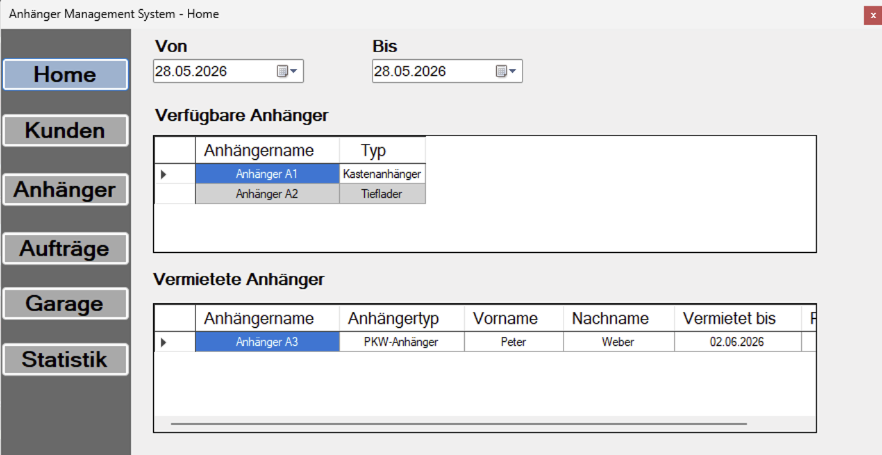
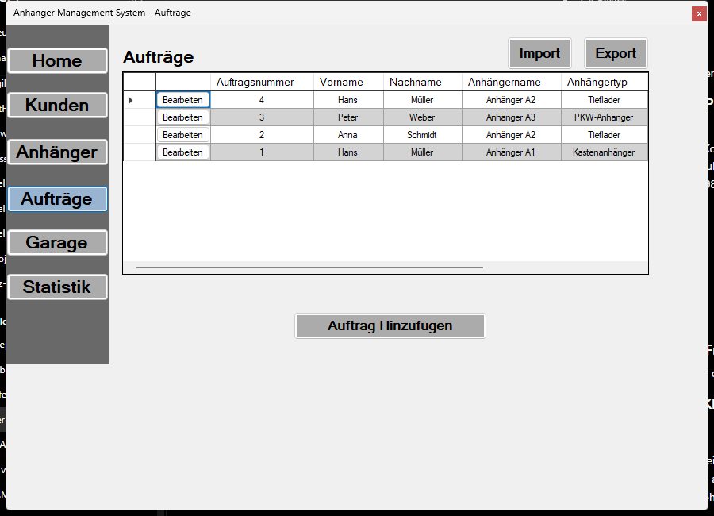
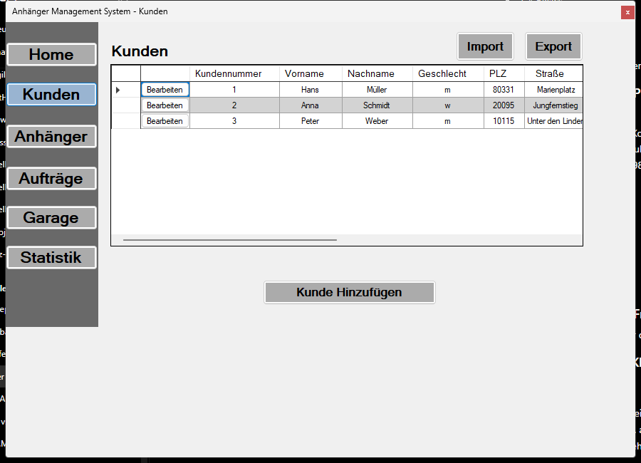
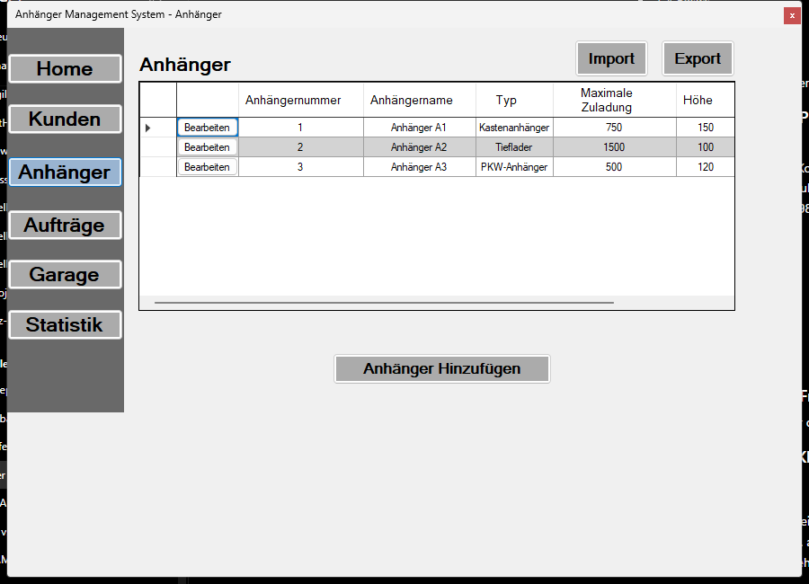
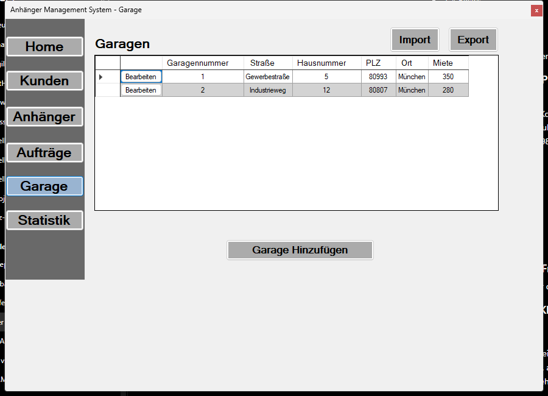
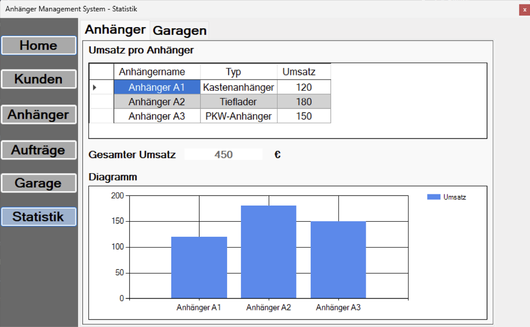

# Trailer Rental Manager

A Windows desktop application for managing a small trailer rental workflow.

Trailer Rental Manager keeps customer records, trailer master data and rental orders in one local application. It provides an availability overview by date range, tracks garage costs, and includes CSV import/export for moving data in and out of the system. CSV imports are validated before rental-order data is written. The application creates its local SQLite database automatically on first start, so no database file is required in the repository.

The user interface is German because the original use case was for German-speaking users. The code structure, database schema, tests and documentation are kept in English.

## Screenshots

| Home | Rental orders |
| --- | --- |
|  |  |

| Customers | Trailers |
| --- | --- |
|  |  |

| Garages | Statistics |
| --- | --- |
|  |  |

## Download & Install

1. Go to the [Releases](../../releases/latest) page.
2. Download `TrailerRentalManager-Setup-v*.exe`.
3. Run the installer — no additional software required.

> **Requirements:** Windows 10 (version 1903 or later) or Windows 11. .NET Framework 4.8 is included in these versions of Windows and does not need to be installed separately.

## Features

- Customer management
- Trailer management
- Rental order management
- Availability overview by date range
- Garage and cost management
- CSV import and export
- Basic revenue and cost statistics
- Automatic local database creation

## Tech Stack

- C#
- Windows Forms
- .NET Framework 4.8
- SQLite
- ADO.NET
- MSTest

## Project Structure

- `Trailer Rental Manager/Forms` contains the Windows Forms UI.
- `Trailer Rental Manager/CSharp/Repositories` contains SQLite data access.
- `Trailer Rental Manager/CSharp/Services` contains testable business and utility logic.
- `TrailerRentalManager.Tests` contains MSTest unit and integration tests.
- `docs` contains supporting documentation such as the database schema and screenshots.

## Setup

1. Install Visual Studio with the `.NET desktop development` workload.
2. Clone or download this repository.
3. Open `Trailer Rental Manager.sln`.
4. Restore NuGet packages.

   NuGet packages are external libraries used by the project, for example SQLite and the test framework. The `packages` folder is not stored in the repository; Visual Studio restores it from `packages.config`. Visual Studio usually restores packages automatically when the solution is opened or built. If it does not, right-click the solution in Solution Explorer and select `Restore NuGet Packages`. An internet connection is required the first time packages are restored on a computer.

5. Build the solution with `Build > Build Solution`.
6. Select the main application project and press Start.

On first start, the application creates a local SQLite database file automatically. No database file is included in the repository. During development, the local database file can be deleted to reset the application data. The schema is recreated automatically on the next start.

## Running Tests

1. Open the solution in Visual Studio.
2. Build the solution.
3. Open Test Explorer with `Test > Test Explorer`.
4. Click `Run All Tests`.

The tests cover:

- date overlap and availability logic
- customer, trailer and rental order validators
- CSV import/export behavior
- rental-order CSV validation and roundtrip behavior
- database initialization
- SQL parameterization with apostrophes and injection-like input

## Documentation

- [Architecture](docs/architecture.md)
- [Database model](docs/database.md)
- [Database schema SQL](docs/database-schema.sql)

## Data and Generated Files

No real customer data is included in this repository. Runtime SQLite database files, build output, Visual Studio user files and test result folders are excluded through `.gitignore`.

## Notes

- The user interface is German.
- Technical code structure and documentation are English.
- The application is intentionally simple and local-first.
