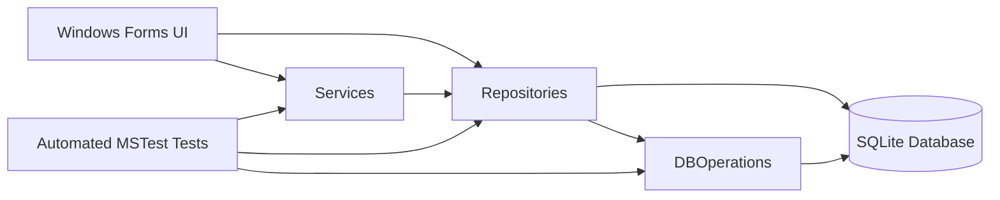

# Architecture

Trailer Rental Manager is a local Windows Forms application. Forms handle user interaction and screen navigation, services contain validation and import/export logic, repositories contain SQLite access, and `DBOperations` owns shared database connection and initialization behavior.

The application is intentionally small and direct: forms may call repositories for simple reads, while reusable business rules and CSV handling live in services so they can be covered by automated tests.

## Main Areas

- `Trailer Rental Manager/Forms` contains the German Windows Forms UI.
- `Trailer Rental Manager/CSharp/Services` contains validation, availability and CSV import/export logic.
- `Trailer Rental Manager/CSharp/Repositories` contains ADO.NET queries for SQLite tables.
- `Trailer Rental Manager/CSharp/Operations/DBOperations.cs` creates the local database and provides shared SQLite helpers.
- `TrailerRentalManager.Tests` contains MSTest tests for services, repositories and database initialization.
