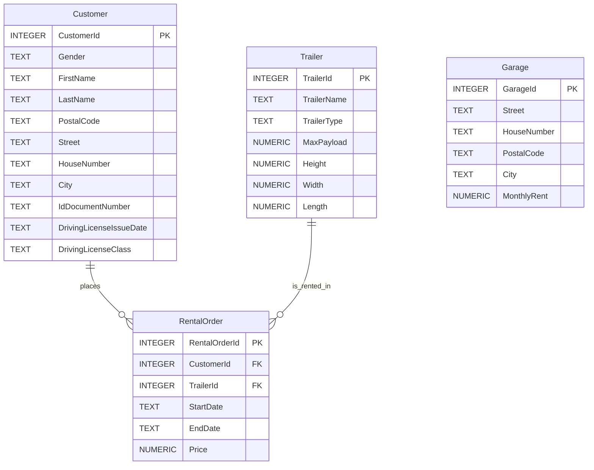

# Database

The application stores its data in a local SQLite database that is created automatically on first start. The schema is defined in `DBOperations` and mirrored in `docs/database-schema.sql`.

Dates in `RentalOrder.StartDate` and `RentalOrder.EndDate` are stored as ISO text in `yyyy-MM-dd` format. Same-day rentals are valid, so the schema allows `EndDate` to be equal to `StartDate`.

## Important Constraints

- `Customer.Gender` is limited to `w`, `m` or `d`.
- `Garage.MonthlyRent` must be non-negative.
- `RentalOrder.Price` must be non-negative.
- `RentalOrder.StartDate` and `RentalOrder.EndDate` must be valid ISO `yyyy-MM-dd` date strings.
- `RentalOrder.EndDate` must be greater than or equal to `RentalOrder.StartDate`.
- `RentalOrder.CustomerId` references `Customer.CustomerId`.
- `RentalOrder.TrailerId` references `Trailer.TrailerId`.
